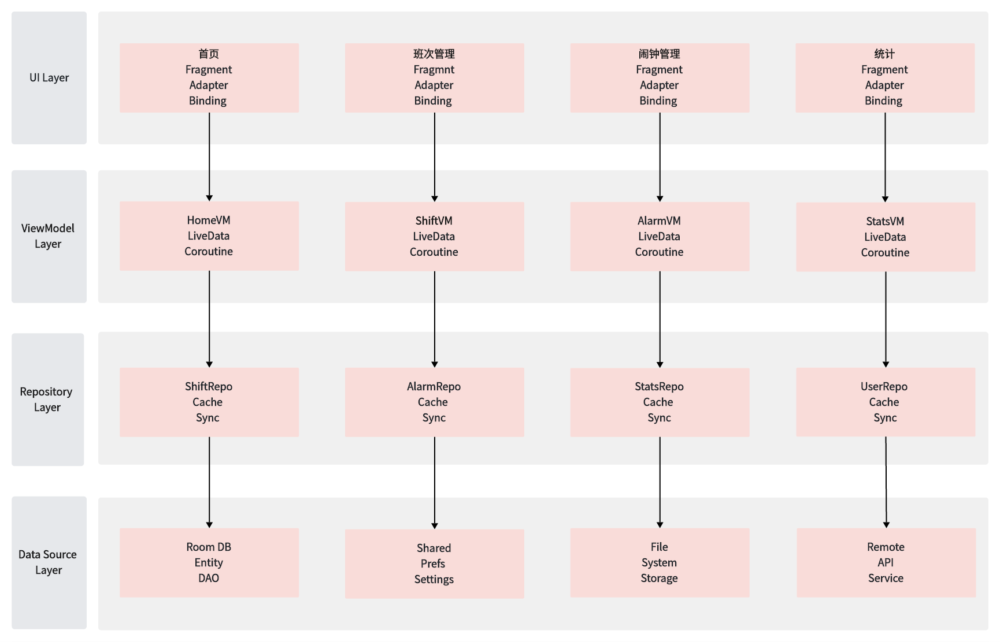

# 排班助手 (Scheduling Assistant)

## 项目简介
排班助手是一款专为需要倒班工作的人员设计的Android应用。它提供了直观的排班管理、闹钟提醒和数据统计功能，帮助用户更好地管理自己的工作时间。

## 核心功能
- 班次管理：创建、编辑和删除班次
- 闹钟提醒：为不同班次设置闹钟
- 数据统计：查看排班统计和分析
- 个性化设置：自定义班次颜色和提醒方式

## 技术架构

### 目录结构
```
app/src/main/
├── java/com/schedule/assistant/
│   ├── data/
│   │   ├── dao/          # 数据访问对象
│   │   ├── entity/       # 数据实体类
│   │   ├── repository/   # 数据仓库
│   │   └── converter/    # 类型转换器
│   ├── ui/
│   │   ├── adapter/      # 列表适配器
│   │   ├── alarm/        # 闹钟管理
│   │   ├── calendar/     # 日历组件
│   │   ├── dialog/       # 对话框
│   │   ├── home/         # 主页
│   │   ├── profile/      # 个人中心
│   │   ├── shift/        # 班次管理
│   │   └── stats/        # 统计分析
│   ├── viewmodel/        # 视图模型
│   └── util/             # 工具类
├── res/
│   ├── layout/          # 布局文件
│   ├── drawable/        # 图形资源
│   ├── values/          # 资源值
│   └── navigation/      # 导航图
└── AndroidManifest.xml
```

### 系统架构图
```
┌───────────────────────────────── 应用架构 ────────────────────────────────┐
│                                                                          │
│  ┌────────────────────────────── UI Layer ─────────────────────────────┐ │
│  │                                                                    ││ |
│  │  ┌───────────┐    ┌───────────┐    ┌───────────┐    ┌───────────┐  ││ |
│  │  │   首页     │    │  班次管理  │    │  闹钟管理  │     │  统计     │  ││ |
│  │  │ Fragment  │    │ Fragment  │    │ Fragment  │    │ Fragment  │  ││ |
│  │  │ Adapter   │    │ Adapter   │    │ Adapter   │    │ Adapter   │  ││ |
│  │  │ Binding   │    │ Binding   │    │ Binding   │    │ Binding   │  ││ |
│  │  └─────┬─────┘    └─────┬─────┘    └─────┬─────┘    └─────┬────=┘  ││ |
│  │        │                │                 │                │       ││ |
│  └────────┼────────────────┼─────────────────┼────────────────┼───────┘│ |
│           │                │                 │                │        │ |
│  ┌────────┼────────────────┼─────────────────┼────────────────┼──────┐ │ |
│  │        │         ViewModel Layer          │                │      │ │ |
│  │        ▼                ▼                 ▼                ▼      │ │ |
│  │  ┌───────────┐    ┌───────────┐    ┌───────────┐    ┌───────────┐ │ │ |
│  │  │  HomeVM   │    │  ShiftVM  │    │  AlarmVM  │    │  StatsVM  │ │ │ |
│  │  │ LiveData  │    │ LiveData  │    │ LiveData  │    │ LiveData  │ │ │ |
│  │  │ Coroutine │    │ Coroutine │    │ Coroutine │    │ Coroutine │ │ │ |
│  │  └─────┬─────┘    └─────┬─────┘    └─────┬─────┘    └─────┬─────┘ │ │ |
│  │        │                │                 │                │      │ │ |
│  └────────┼────────────────┼─────────────────┼────────────────┼──────┘ │ |
│           │                │                 │                │        │ |
│  ┌────────┼────────────────┼─────────────────┼────────────────┼───────┐│ |
│  │        │         Repository Layer         │                │       ││ |
│  │        ▼                ▼                 ▼                ▼       ││ |
│  │  ┌───────────┐    ┌───────────┐    ┌───────────┐    ┌───────────┐  ││ |
│  │  │ShiftRepo  │    │ AlarmRepo │    │ StatsRepo │    │ UserRepo  │  ││ |
│  │  │Cache      │    │ Cache     │    │ Cache     │    │ Cache     │  ││ |
│  │  │Sync       │    │ Sync      │    │ Sync      │    │ Sync      │  ││ |
│  │  └─────┬─────┘    └─────┬─────┘    └─────┬─────┘    └─────┬─────┘  ││ |
│  │        │                │                 │                │       ││ |
│  └────────┼────────────────┼─────────────────┼────────────────┼───────┘│ |
│           │                │                 │                │        │ |
│  ┌────────┼────────────────┼─────────────────┼────────────────┼──────┐ │ |
│  │        │         Data Source Layer        │                │      │ │ |
│  │        ▼                ▼                 ▼                ▼      │ │ |
│  │  ┌───────────┐    ┌───────────┐    ┌───────────┐    ┌───────────┐ │ │ |
│  │  │ Room DB   │    │  Shared   │    │   File    │    │  Remote   │ │ │ |
│  │  │ Entity    │    │  Prefs    │    │  System   │    │   API     │ │ │ |
│  │  │ DAO       │    │ Settings  │    │ Storage   │    │ Service   │ │ │ |
│  │  └───────────┘    └───────────┘    └───────────┘    └───────────┘ │ │ |
│  │                                                                   │ │ |
│  └───────────────────────────────────────────────────────────────────┘ │ |
│                                                                        │ |
└────────────────────────────────────────────────────────────────────────┘─┘ 
```


数据流向：
┌──────────┐    ┌──────────┐    ┌──────────┐    ┌──────────┐
│   UI     │ -> │ViewModel │ -> │Repository│ -> │  Data    │
│  Layer   │    │  Layer   │    │  Layer   │    │ Source   │
└──────────┘    └──────────┘    └──────────┘    └──────────┘
      ▲              │               │               │
      │              │               │               │
      └──────────────┴───────────────┴───────────────┘
           LiveData观察          异步数据流

数据处理流程：
1. UI Layer
   ├─ 用户操作触发
   ├─ 调用ViewModel方法
   └─ 观察LiveData变化

2. ViewModel Layer
   ├─ 处理UI逻辑
   ├─ 调用Repository
   └─ 更新LiveData

3. Repository Layer
   ├─ 数据缓存策略
   ├─ 数据源选择
   └─ 数据同步处理

4. Data Source Layer
   ├─ 本地数据库操作
   ├─ 文件系统访问
   ├─ 配置信息管理
   └─ 远程API调用
```

### 架构说明
1. **UI Layer（表现层）**
   - Fragment：页面展示和用户交互
   - Adapter：列表数据适配
   - ViewBinding：视图绑定
   - 采用单Activity多Fragment结构

2. **ViewModel Layer（视图模型层）**
   - 管理UI状态和数据
   - 处理业务逻辑
   - 使用LiveData实现数据观察
   - 保证配置变更时的数据存活

3. **Repository Layer（数据仓库层）**
   - 统一的数据访问接口
   - 数据来源的协调和调度
   - 实现数据缓存策略
   - 处理数据转换和业务规则

4. **Data Source Layer（数据源层）**
   - Room：本地数据库存储
   - SharedPreferences：配置信息
   - FileSystem：文件存储
   - RemoteAPI：网络数据（预留）

### 关键特性
- 单向数据流
- 关注点分离
- 依赖注入
- 响应式编程
- 可测试性设计

### 基础框架
- 开发语言：Java 17
- 最低SDK：Android 7.0 (API 24)
- 目标SDK：Android 14 (API 34)
- 构建工具：Gradle 8.2.0

### 架构模式
- MVVM (Model-View-ViewModel)架构
- Repository模式数据管理
- 单Activity多Fragment结构
- LiveData响应式编程

### 数据层
- SQLite数据库
  - Room持久化库
  - DAO数据访问模式
  - 数据迁移策略
- SharedPreferences配置存储
- 文件存储系统

### UI组件
- AndroidX组件库
- Material Design 3
- RecyclerView + ListAdapter
- ViewBinding视图绑定
- CalendarView日历控件
- ConstraintLayout布局
- Navigation导航组件

### 功能组件
- WorkManager任务调度
- AlarmManager闹钟服务
- NotificationManager通知管理
- MPAndroidChart图表展示
- FileProvider文件共享

### 工具支持
- Kotlin协程（Java互操作）
- Lifecycle组件
- ViewPager2页面切换
- SwipeRefreshLayout下拉刷新
- BottomSheetDialog底部弹窗

### 测试框架
- JUnit单元测试
- Espresso UI测试
- Mockito模拟测试
- AndroidX Test测试支持库

### 技术实现细节

#### 1. 数据流转与状态管理
```
数据流转示意：
┌─────────────┐     ┌─────────────┐     ┌─────────────┐
│   View      │     │  ViewModel  │     │ Repository  │
│  (UI状态)    │ ←──  │  (数据转换) │ ←── │ (数据获取)   │
└─────────────┘     └─────────────┘     └─────────────┘
      │                    ↑                   ↑
      │                    │                   │
      └────────────────────┘                   │
         用户操作触发        数据库/网络/文件操作   │
                           ↑                   │
                           └───────────────────┘
```

#### 2. 关键组件实现
- **数据绑定机制**
  ```java
  // ViewModel中的LiveData定义
  private final MutableLiveData<List<ShiftType>> shiftTypes = new MutableLiveData<>();
  
  // Fragment中的观察者模式
  viewModel.getShiftTypes().observe(getViewLifecycleOwner(), types -> {
      adapter.submitList(types);
  });
  ```

- **异步操作处理**
  ```java
  // Repository中的协程使用
  public class ShiftRepository {
      public LiveData<List<Shift>> getShifts() {
          return shiftDao.getAllShifts();  // Room自动在后台线程执行
      }
      
      public void insertShift(Shift shift) {
          executor.execute(() -> {
              shiftDao.insert(shift);
          });
      }
  }
  ```

#### 3. 模块间通信
```
┌─────────────┐   Event Bus   ┌─────────────┐
│  Fragment A │ ────────────> │  Fragment B │
└─────────────┘               └─────────────┘
      ↑                            ↑
      │                            │
      └────────────────────────────┘
           共享ViewModel通信

通信方式：
1. LiveData观察
2. SharedViewModel共享
3. Navigation组件传参
4. EventBus消息
```

#### 4. 数据缓存策略
```
┌─────────────┐
│  内存缓存     │ ← 首选
└─────────────┘
       ↓
┌─────────────┐
│  本地数据库   │ ← 持久化
└─────────────┘
       ↓
┌─────────────┐
│  网络请求     │ ← 备选
└─────────────┘

缓存策略：
1. 优先使用内存缓存
2. 内存缓存失效时访问数据库
3. 必要时请求网络更新
```

#### 5. 错误处理机制
```
┌─────────────┐     ┌─────────────┐     ┌─────────────┐
│   异常发生   │ ──>  │  错误转换    │ ──> │  UI展示     │
└─────────────┘     └─────────────┘     └─────────────┘
                          ↓
                    ┌─────────────┐
                    │  日志记录    │
                    └─────────────┘

错误处理流程：
1. 异常捕获与转换
2. 错误信息本地化
3. 用户友好提示
4. 日志记录追踪
```

#### 6. 性能优化策略
```
性能优化要点：
┌────────────────────┐
│     UI渲染优化      │
├────────────────────┤
│ - ViewHolder复用   ｜
│ - 布局层级优化       │
│ - 按需加载          │
└────────────────────┘

┌────────────────────┐
│     数据加载优化     │
├────────────────────┤
│ - 分页加载          │
│ - 预加载机制         │
│ - 缓存策略          │
└────────────────────┘

┌────────────────────┐
│     内存优化        │
├────────────────────┤
│ - 内存泄漏监控       │
│ - 大对象延迟加载     │
│ - 及时释放资源       │
└────────────────────┘
```

## 开发进度

### 2024-01-04
1. 优化了班次列表适配器（ShiftListAdapter）的实现
   - 修复了静态内部类访问外部类方法的问题
   - 改进了ViewHolder的数据持有方式
   - 优化了点击事件的处理逻辑

2. 改进了闹钟适配器（AlarmAdapter）的实现
   - 使用getBindingAdapterPosition替代已废弃的getAdapterPosition
   - 增加了位置有效性检查
   - 优化了删除事件的处理逻辑

3. 代码质量改进
   - 统一了适配器中的ID比较逻辑
   - 增强了列表项操作的安全性
   - 改进了数据一致性的处理

### 2024-01-05
1. 修复了主页班次统计显示问题
   - 实现了动态班次类型统计显示
   - 修复了统计数量不同步问题
   - 优化了统计显示的视觉效果
   - 支持自定义班次类型的统计

2. 修复了今日排班显示问题
   - 修复了添加排班后今日排班不显示的问题
   - 优化了LiveData观察者的实现
   - 改进了数据更新机制

3. 代码优化
   - 优化了Fragment生命周期管理
   - 改进了视图绑定的使用
   - 增强了代码的健壮性

### 待办事项
1. 完善单元测试覆盖率
2. 优化用户界面交互体验
3. 增强数据同步机制
4. 改进错误处理机制

### ✅ 已完成功能
- ✅ 项目基础架构搭建
  - MVVM架构实现
  - 数据库迁移到版本5
  - Navigation导航框架集成
  - ViewBinding实现
- ✅ 数据层实现
  - Room数据库配置
  - 实体类定义（Shift, ShiftType, Alarm等）
  - DAO接口实现
  - Repository模式封装
- ✅ UI层实现
  - Fragment基类封装
  - 自定义View组件
  - Material Design 3规范应用
  - 响应式布局适配
- ✅ 业务功能实现
  - 班次管理基础功能
  - 日历展示与交互
  - 备注功能（限制20字符）
  - 班次类型管理
- ✅ 测试框架搭建
  - JUnit单元测试框架
  - Espresso UI测试
  - MainActivityTest实现
- ✅ UI优化更新
  - 主页班次信息突出显示
  - 绿色背景突出今日班次
  - 界面布局优化调整
  - 自定义班次类型颜色支持
- ✅ 主页功能优化
  - 动态班次类型统计显示
  - 今日排班信息同步
  - 班次统计准确性保证

### 🚧 开发中功能
- 🔄 班次管理模块优化 (预计完成时间: 2025-01-25)
  - 班次列表展示优化
  - 班次详情界面完善
  - 班次操作流程优化
  - 班次数据同步机制
  - 班次冲突检测
  - 自定义班次类型管理
  - 数据迁移方案完善
  - 性能优化

### 📋 待开发功能

#### ⏰ Phase 4: 闹钟管理功能 (预计完成: 2025-02-05)
- ⏳ [TASK-4.1] 闹钟管理布局
  - AlarmFragment UI实现
  - 闹钟列表适配器
  - 闹钟设置对话框
- ⏳ [TASK-4.2] 闹钟核心功能
  - AlarmManager集成
  - 闹钟提醒服务
  - 通知管理
- ⏳ [TASK-4.3] 闹钟高级功能
  - 重复提醒设置
  - 自定义铃声
  - 振动模式配置

#### 📊 Phase 5: 排班统计 (预计完成: 2025-02-15)
- ⏳ [TASK-5.1] 统计界面布局
- ⏳ [TASK-5.2] 日期范围选择与图表更新
- ⏳ [TASK-5.3] 排班详情显示

#### ⚙️ Phase 6: 我的设置 (预计完成: 2025-02-25)
- ⏳ [TASK-6.1] 设置界面布局
- ⏳ [TASK-6.2] 通知设置功能
- ⏳ [TASK-6.3] 日志提取功能

#### 🔧 Phase 7: 性能优化与测试 (预计完成: 2025-03-05)
- ⏳ [TASK-7.1] 性能优化
  - RecyclerView优化
  - 数据库查询优化
  - UI渲染优化
- ⏳ [TASK-7.2] 代码重构与清理
- ⏳ [TASK-7.3] UI测试完善

#### 🔒 Phase 8: 安全与数据保护 (预计完成: 2025-03-15)
- ⏳ [TASK-8.1] 数据加密
- ⏳ [TASK-8.2] 通信安全

#### 🚀 Phase 9: 发布与部署 (预计完成: 2025-03-25)
- ⏳ [TASK-9.1] 应用打包与发布
- ⏳ [TASK-9.2] 用户反馈与改进

### 任务状态说明
- ✅ 已完成
- 🔄 开发中
- ⏳ 待开发
- ❌ 已取消

## 快速开始

### 环境要求
- Android Studio Hedgehog | 2023.1.1 或更高版本
- JDK 17 或更高版本
- Android SDK Platform 34
- Android Build Tools v34.0.0

### 安装步骤
1. 克隆项目到本地
```bash
git clone https://github.com/xiaolin0429/SchedulingAssistant.git
```

2. 使用Android Studio打开项目

3. 同步Gradle依赖
```bash
./gradlew build
```

4. 运行项目
- 选择目标设备（真机或模拟器）
- 点击运行按钮或使用快捷键`Shift + F10`

## 使用指南
1. 首次启动
   - 授予必要权限
   - 查看功能引导
   
2. 基本操作
   - 点击日期查看/编辑班次
   - 左右滑动切换月份
   - 使用底部导航切换功能
   
3. 高级功能
   - 长按日期进行快速编辑
   - 使用筛选器查找特定班次
   - 导出统计数据

## 开发规范
1. 代码规范
   - 遵循Java代码规范
   - 使用统一的代码格式化工具
   - 保持代码简洁清晰
   - 遵守最小修改原则，不允许随意修改现有代码
   - 需要修改现有功能时，优先使用继承/重写方式
   - 保留原有方法/类/接口的功能，确保向后兼容
   - 按照设计模式思想，遵守六大原则：开闭原则、里氏代换原则、依赖倒转原则、接口隔离原则、迪米特法则、合成复用原则

2. 资源文件修改规范
   - 修改资源文件前必须全局检查引用关系
   - 确保修改不影响其他模块的正常调用
   - 对于共用资源，需要评估修改影响范围
   - 建议新增资源而不是修改现有资源
   - 必要的修改需要在代码审查时重点关注

3. 命名规范
   - 类名：大驼峰命名法
   - 变量名：小驼峰命名法
   - 常量：全大写下划线分隔

4. 注释规范
   - 类和方法必须添加文档注释
   - 关键代码添加必要的注释
   - 保持注释的及时更新

5. 版本控制
   - 使用Git进行版本控制
   - 遵循分支管理规范
   - 提交信息要清晰明确

### 最近更新
1. 完成项目初始化和基础框架搭建
2. 实现底部导航栏和基本页面切换
3. 开始主页日历功能开发
4. 进行班次管理模块的开发

### 下一步计划
1. 完成主页日历的排班展示功能
2. 实现班次的添加、编辑和删除功能
3. 开发闹钟管理模块
4. 进行数据统计功能的开发

### 贡献指南
1. Fork 项目仓库
2. 创建功能分支
3. 提交代码更改
4. 发起合并请求

### 版本历史
- v0.1.0 (2025-01-04)
  - 项目初始化
  - 基础框架搭建
  - 底部导航实现

### 作者
- 开发团队：[xiaolin0429]
- 联系邮箱：[邮箱地址]

### 许可证
本项目采用 MIT 许可证 
